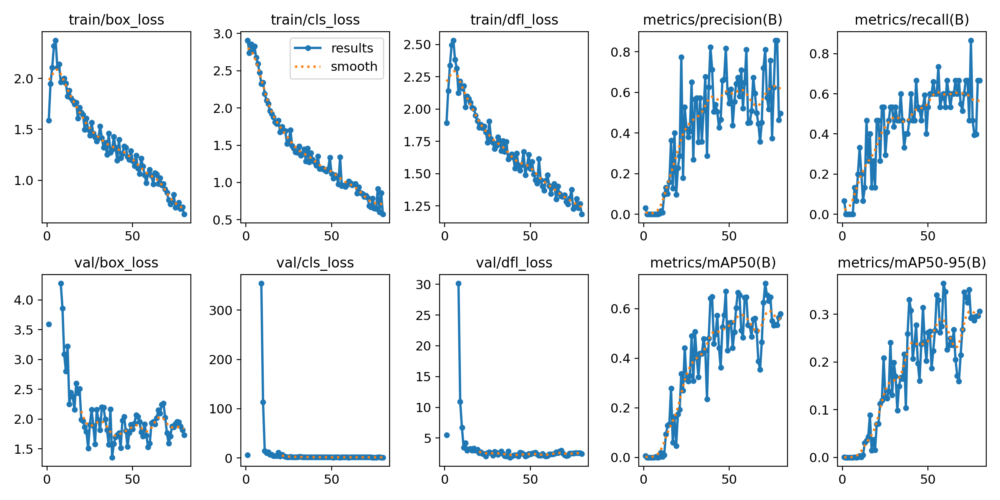
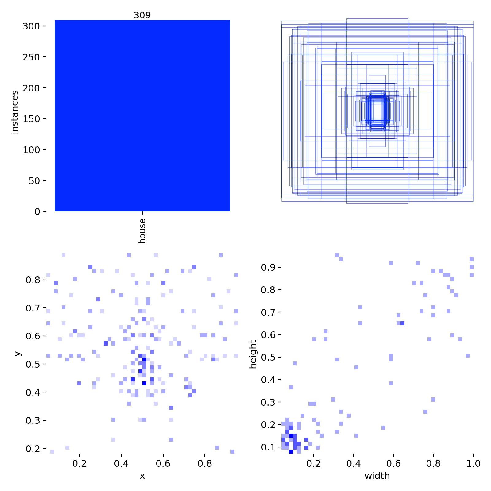
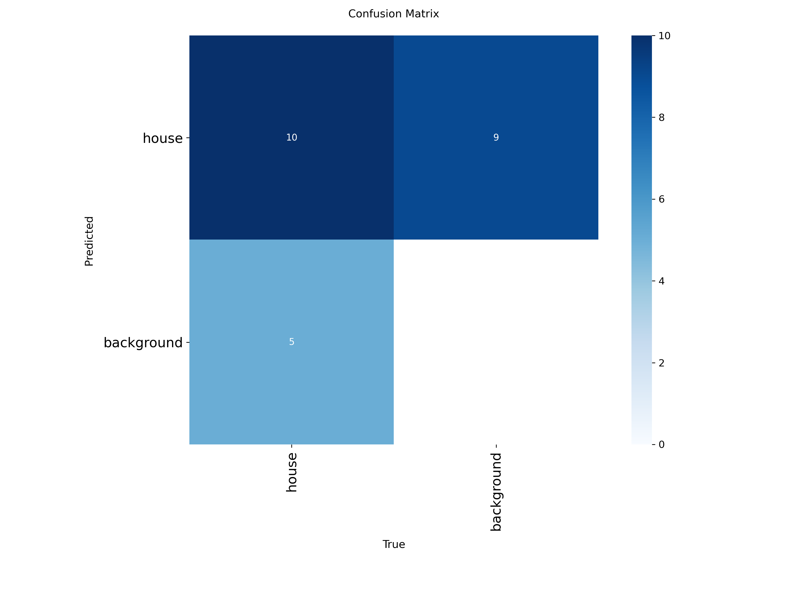
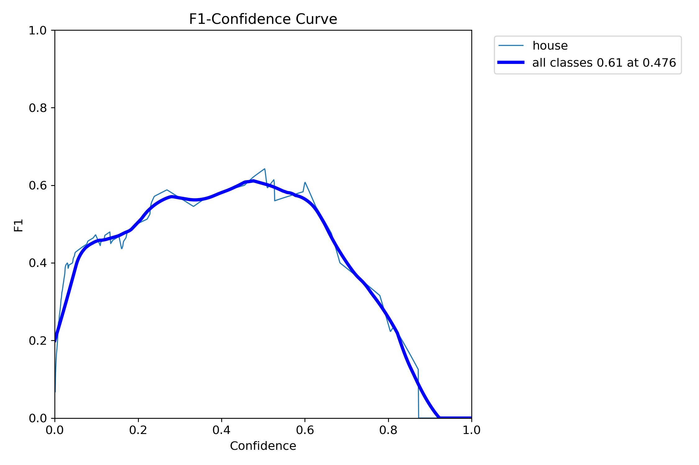
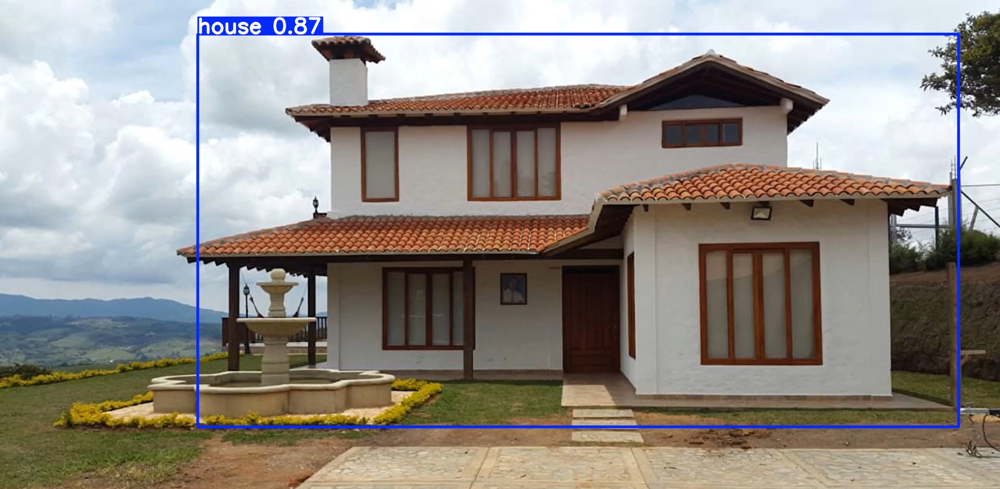
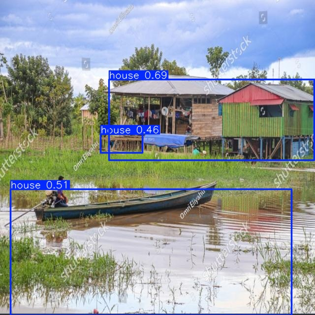
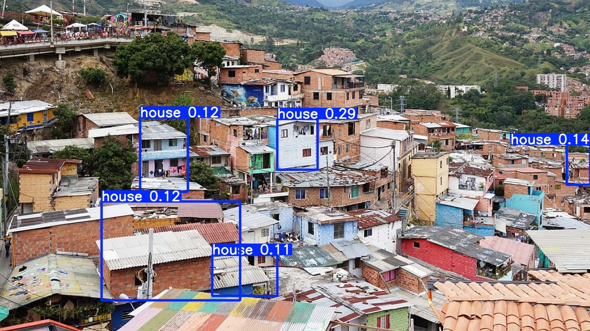
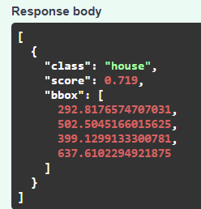

# Taller YOLO – Detección de Casas Colombianas

## Descripción general
Este proyecto implementa un modelo **YOLOv11l** para la detección de casas colombianas en imágenes rurales y urbanas.  
El objetivo es identificar estructuras residenciales y analizar el desempeño del modelo frente a distintos tipos de arquitectura presentes en el país.

---

## Dataset y origen de imágenes
El dataset fue construido manualmente con **309 instancias** de la clase **“house”**, a partir de imágenes recopiladas de distintas fuentes:
 
- Páginas inmobiliarias nacionales – portales de bienes raíces en Colombia.  
- Shutterstock, dreamstime, entre otros portales de imágenes libres – para aumentar la diversidad arquitectónica y visual.

**Estructura del dataset:**
```bash
dataset/
├── train/
│   ├── images/
│   ├── labels/
│   
├── valid/
│   ├── images/
│   ├── labels/
│   
└── test/
```
**Dataset_roboflow_url:** https://app.roboflow.com/charly-zokkb/casas_colombianas-n2gog/3 

**Única Clase:** `house`  

**Distribución antes del data-augmentation:**  
- Train: 75 imágenes  80%
- Val: 15 imágenes  20%  
---

### Preprocesamiento
| Proceso | Descripción |
|----------|-------------|
| **Auto-Orient** | Aplicado automáticamente para corregir orientación EXIF de las imágenes. |
| **Resize** | Todas las imágenes fueron redimensionadas a **640 × 640 píxeles** (stretch manteniendo proporciones globales). |

---


### Aumentaciones (Roboflow)
Cada imagen original generó **3 variaciones aumentadas** para el entrenamiento, aplicando transformaciones aleatorias controladas:

| Tipo de Augmentación | Rango aplicado |
|----------------------|----------------|
| **Flip** | Horizontal |
| **Hue** | Entre −16° y +16° |
| **Saturation** | Entre −25 % y +25 % |
| **Brightness** | Entre −20 % y +20 % |
| **Exposure** | Entre −10 % y +10 % |

Estas transformaciones ayudan a simular variaciones reales de color, iluminación y exposición entre diferentes regiones del país, mejorando la **robustez y generalización del modelo YOLOv11l** frente a distintos entornos rurales y urbanos.

---

**División del dataset despues del data-augmentation:**

| Conjunto | Porcentaje | Imágenes |
|-----------|-------------|-----------|
| Train | 92 % | 153 |
| Validation | 8 % | 13 |


---


## Entrenamiento del modelo

### Configuración
```python
from ultralytics import YOLO

model = YOLO('yolo11l.pt')
data_path = 'data.yaml'

results = model.train(
    data=data_path,
    epochs=80,
    imgsz=640,
    batch=8,
    patience=25
)
```

Entrenamiento realizado en **Google Colab (GPU Tesla T4)** con una duración total aproximada de **0.26 horas**.

---

## Resultados de la validación 

Al completar las 80 épocas de entrenamiento, YOLO evalúa automáticamente el modelo final (`best.pt`) sobre el conjunto de **validación** definido en `data.yaml`.  
Estas métricas reflejan el rendimiento del modelo frente a **imágenes no vistas durante el entrenamiento**.

### Resumen numérico de validación
```
Class     Images  Instances  Precision  Recall  mAP50  mAP50-95
all          13         15      0.644    0.600   0.644   0.370
```

| Métrica | Valor | Interpretación |
|----------|--------|----------------|
| Precisión (P) | 0.64 | 64 % de las detecciones son correctas |
| Recall (R) | 0.60 | 60 % de las casas reales fueron detectadas |
| mAP@50 | 0.64 | Buen rendimiento general |
| mAP@50–95 | 0.37 | Ajuste de cajas razonable para dataset pequeño |

---

## Análisis de las curvas del entrenamiento

### Gráficas de pérdida y desempeño


**Análisis:**
- Las pérdidas de entrenamiento (`train/box_loss`, `cls_loss`, `dfl_loss`) descienden de forma progresiva, indicando un aprendizaje estable.  
- Las pérdidas de validación (`val/box_loss`, `val/cls_loss`) se estabilizan después de unas 20 épocas, lo que sugiere que el modelo no sufre sobreajuste fuerte.  
- La precisión y el recall crecen gradualmente hasta estabilizarse en el rango de 0.6–0.8.  
- El mAP@50–95 se mantiene en torno a 0.35, lo cual es esperable en datasets pequeños.

---

## Distribución y análisis de instancias

### Mapa de instancias


**Análisis:**
- Existen 309 instancias de la clase “house”.  
- Las casas están centradas mayormente en el eje Y, lo que refleja imágenes con fachadas frontales.  
- La mayoría de las bounding boxes tienen una anchura entre 0.2 y 0.6, correspondientes a casas completas o estructuras centrales.

---

## Matriz de confusión (Validación)

### Visualización


**Análisis:**
- Se detectaron 10 verdaderos positivos (casas correctamente identificadas).  
- Existen 9 falsos positivos (detecciones de casas donde no había).  
- Existen 5 falsos negativos (casas no detectadas).  
- El modelo muestra una ligera tendencia a sobredetectar objetos similares a casas, pero con buen equilibrio general.

---

## Curva F1 – Confianza

### F1 vs Confianza


**Análisis:**
- La confianza óptima para inferencia es aproximadamente **0.47**.  
- El F1 máximo alcanza **0.61**, representando un equilibrio adecuado entre precisión y recall.  
- A valores de confianza mayores a 0.8, el modelo se vuelve más estricto, reduciendo el recall (menos detecciones verdaderas).

---

## Ejemplos de inferencia

### Ejemplo 1 – Verdadero positivo (detección correcta)

**Análisis:**  
El modelo detecta correctamente la casa principal, con la caja bien ajustada un entorno rural.  
Confianza: 0.87 
Resultado: Verdadero positivo (TP)

---

### Ejemplo 2 – Falso positivo (detección errónea)

**Análisis:**  
El modelo detecta un lago o superficie reflectante como casa con un bote, con confianza de 0.51. Tal vez el material del bote puede tener una textura similar a las casas de zonas costeras utilizadas en el dataset. o tambien puede que se deba al leve reflejo rojo en el lago generado por el techo de la casa. 

Esto podría mejorar aumentando la confianza o etiquetando mas imagenes de casas que se observen reflejos en lagos.
---

### Ejemplo 3 – Falso negativo (detección omitida)

**Análisis:**  
El modelo no detecta muchas casas pequeñas o lejanas.  
Causa probable: objetos demasiado pequeños o parcialmente visibles no generan suficientes características en las capas profundas de YOLO. Además no se entrenó el modelo con el objetivo de detectar muchas viviendas en una misma imagen.

Para que este tipo de escenas se detecten mejor se debe usar un dataset mucho mas grande y con mayor resolución de imgsz en el entrenamiento para mejor detección de objetos pequeños.
---

## Limitaciones

1. Tamaño reducido del dataset (75 imágenes de entrenamiento) que puede causar sobreajuste.  
2. Desbalance arquitectónico: predominan casas rurales sobre urbanas y en Colombia hay mucha diversidad de arquitectura, lo que dificulta la validación en regiónes especificas que no se tomaron en cuenta.  
3. Falsos positivos por similitud visual con techos, muros o agua.  
4. Falta de imágenes negativas (sin casas)(lagos).  
5. Baja generalización hacia contextos urbanos de alta densidad.
---

## Pasos futuros recomendados

| Mejora | Acción sugerida | Beneficio |
|---------|------------------|------------|
| Aumentar dataset | Incluir imágenes urbanas y ejemplos sin casas | Reducir falsos positivos |
| Transfer learning | Reentrenar desde un modelo más robusto (YOLOv11x, SAM, etc.) | Mayor precisión estructural |
| Fine-tuning urbano/rural | Entrenar dos submodelos especializados | Mejor rendimiento geográfico |
| Validación cruzada | Probar en distintas regiones o conjuntos | Evaluación más robusta |

---

## Ejecución de la aplicación FastAPI

### 1. Iniciar servidor
```bash
python src/app.py
```

### 2. Acceder desde el navegador
Abrir:
```
http://127.0.0.1:8000/docs
```

### 3. Probar el endpoint `/predict/`
Subir una imagen `.jpg` o `.png` y recibir un resultado JSON:
```json
[
  {"class": "house", "score": 0.92, "bbox": [145.2, 203.8, 620.9, 400.1]}
]
```
Ejemplo de uso FastAPI para la primera imagen de validación:


---

## Conclusión
El modelo **YOLOv11l** logra detectar de forma efectiva casas rurales colombianas, alcanzando una **precisión del 64 %**, un **recall del 60 %**, y un **mAP@50 de 0.64**, lo que indica un desempeño equilibrado entre exactitud y cobertura en la detección.  
El valor de **mAP@50–95 = 0.37** refleja una capacidad moderada para ajustar las cajas delimitadoras (bounding boxes) a distintos niveles de solapamiento (IoU), siendo consistente con el tamaño reducido y la homogeneidad del dataset.

En general, los resultados muestran que el modelo es **funcional y robusto** frente a variaciones de color, orientación e iluminación, producto de las estrategias de *data augmentation* aplicadas en Roboflow. Sin embargo, su rendimiento puede mejorar significativamente al incrementar la diversidad arquitectónica y geográfica de las muestras.

Las principales limitaciones identificadas son:
1. **Falta de diversidad arquitectónica**: predominan casas rurales, lo que reduce el desempeño en contextos urbanos.  
2. **Posibles sobreajustes**: debido al bajo número de imágenes (153 de entrenamiento, 13 de validación), el modelo puede aprender patrones visuales específicos de un entorno.  
3. **mAP@50–95 moderado**: indica que el modelo aún tiene dificultad para ajustar con precisión las cajas en casos de casas pequeñas o parcialmente visibles.

### Recomendaciones para trabajo futuro
- **Ampliar y balancear el dataset**, incluyendo casas urbanas y ejemplos negativos (sin estructuras residenciales).  
- **Aplicar técnicas de transfer learning** a partir de modelos preentrenados en arquitecturas más amplias (p. ej., **YOLOv11x** o **SAM**) para mejorar la generalización.  
- **Incrementar la resolución de entrada (imgsz)** y la variedad de augmentaciones para reforzar la detección de casas pequeñas o con ángulos complejos.  
- **Realizar validaciones cruzadas** y pruebas regionales (urbano vs. rural) para medir el comportamiento geográfico del modelo.

En síntesis, el modelo YOLOv11l constituye una base sólida para un sistema de **detección automática de viviendas colombianas**, pero requiere mayor cobertura y ajuste fino para alcanzar niveles de precisión propios de aplicaciones productivas o urbanas a gran escala.

